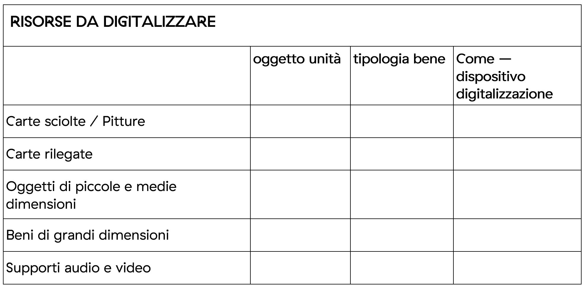
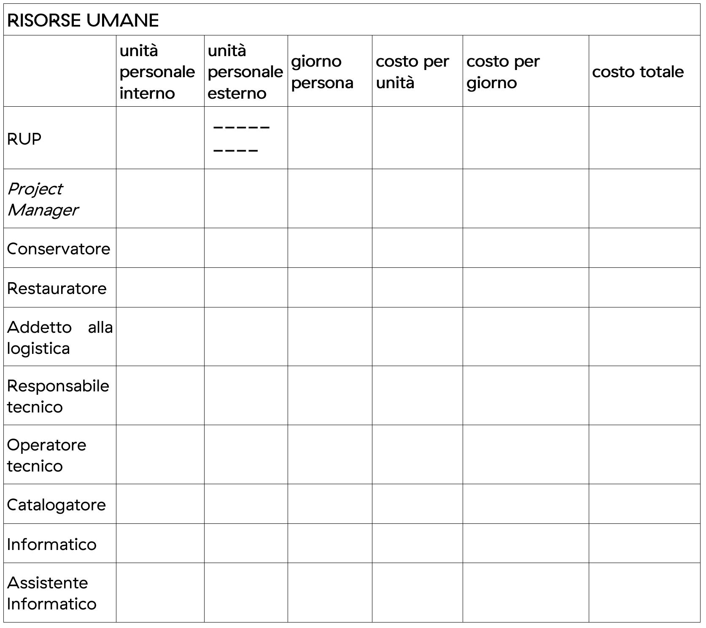
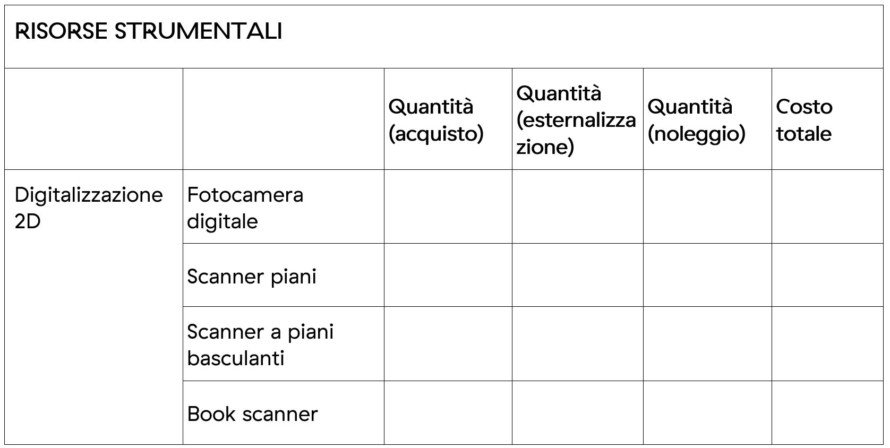
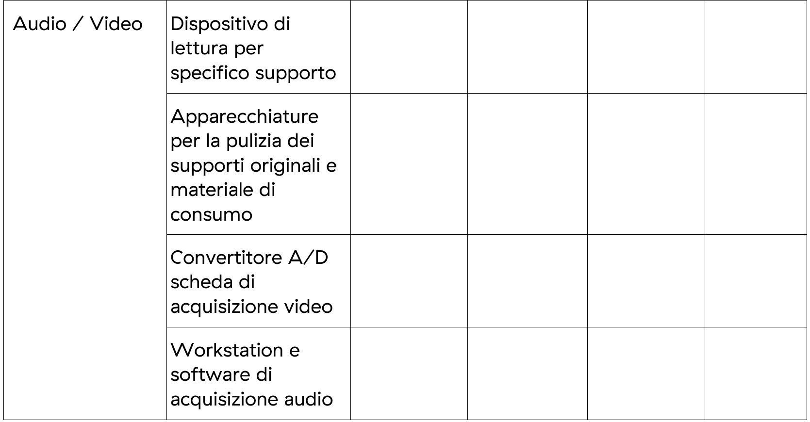
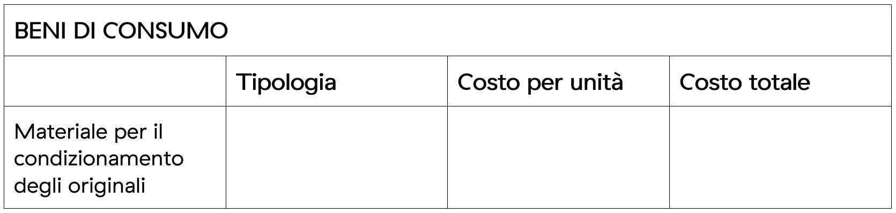
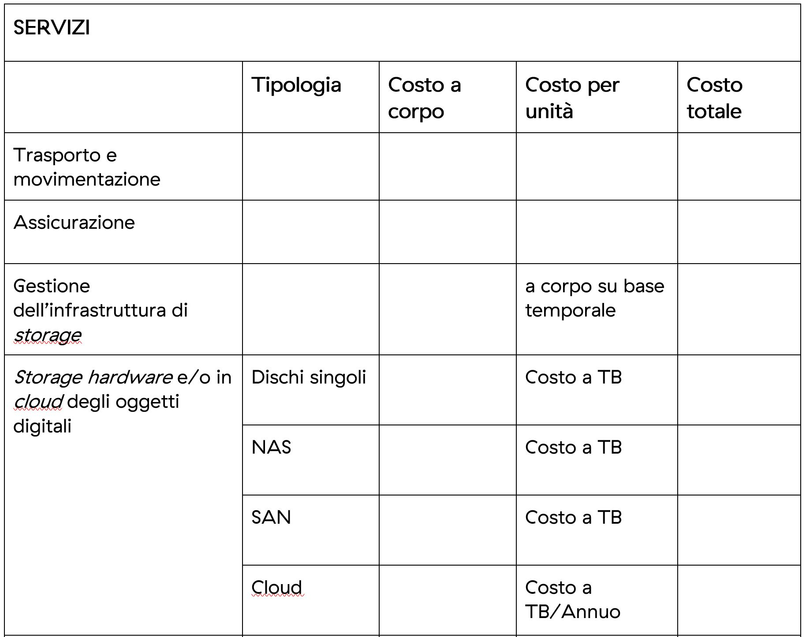
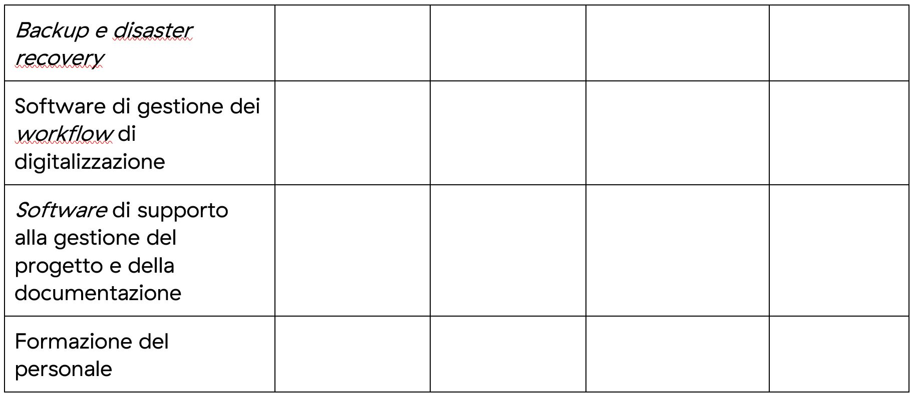
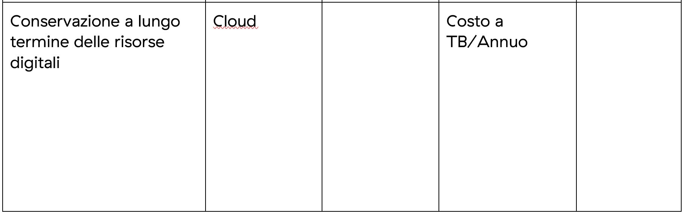

B. Esempio di schema di voci di costo
=====================================

|image0|

|image1|

|image2|

|image3|

|image4|

|image5|

|image6|

|image7|

Dalle tabelle sopra riportate si evince, quindi, che il costo totale di
un progetto di digitalizzazione risulta essere condizionato, oltre che
dalla quantità e tipologia di risorse analogiche e dalla consequenziale
modalità di scansione, dalla integrazione complessiva delle voci di
costo dettagliate per le diverse aree (risorse umane, risorse
strumentali, beni di consumo, servizi).

Nella tabella relative alle “risorse da digitalizzare” non è volutamente
riportato il costo per unità né il costo complessivo in quanto questi
sono influenzati dalle variabili riportate nelle altre quattro tabelle
(risorse umane, risorse strumentali, beni di consumo, servizi).

